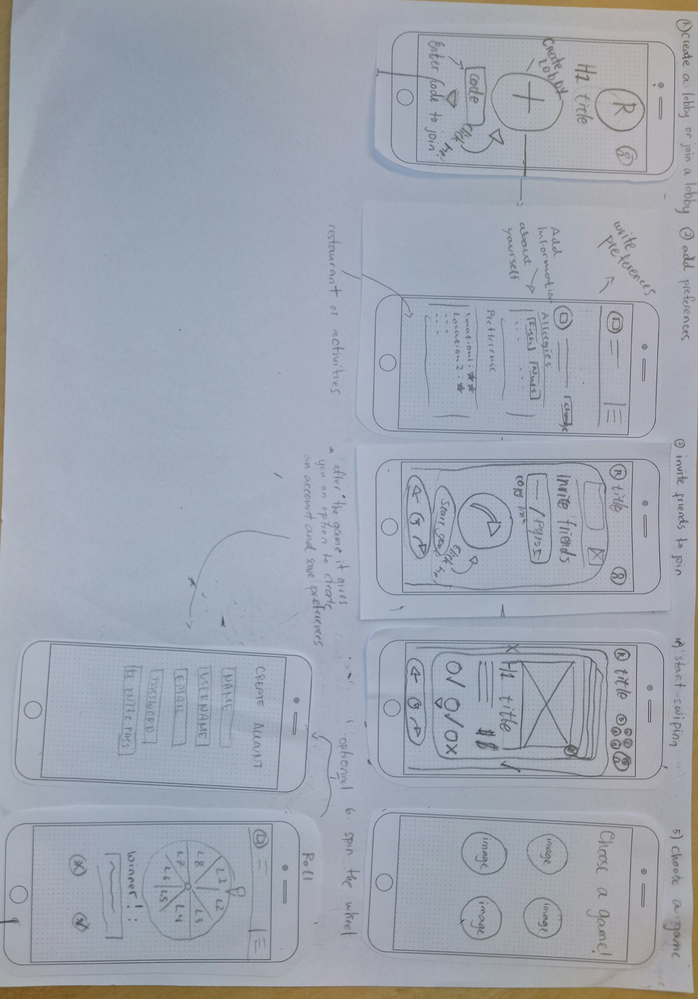

# Vefforritun 2 - Verkefni 2
## Almenn lýsing og wireflows af Vefappi

Daniel, Kjara, Hörður

## WireFrame

=======
## Flamed?
### Description
#### Vefapp þar sem hægt er að finna veitingastað í hóp.

Maður býr til leik, býður vinum sínum og hver og einn "swipar" gegnum veitingastaði, hægri fyrir já, vinstri fyrir nei. Appið finnur svo veitingastað sem allir eru sammála að fara.
Ef að enginn er sammála, eða margir veitingastaðir fundnir, þá er hægt að snúa lukkuhjóli til að ákveða.

#### English
Instead of pulling teeth. Press buttons!
Tired of having to wrangle answers out of people about where to go, only to be shot down by the very same people that told **you** to choose.
With our app, **you** can exploit **their** need for dopamine by feeding them a list of restaurant tailored your prefrences, simply invite your friends to your pre-made group and have them swipe until you have a clear winner, but what if everyone picks something different?
**Remove choice and leave it to chance!**
If there is no winner after swiping, spin the wheel! populated by everyones choices.
Picking a random location will remove any dissenting voices.
- No hassle.
- Quickly put a group together.
- Pick your prefrences.
- Swipe away at an automatically generated list, based on your prefrences.
- Invite your friends to swipe on the list and add more prefrences(if needed).
- Initiate tie breakers.

### User Stories

#### Young People
- **WHO**: Group of friends cant decide on an activity in advance,
- **WHAT**: They open the "Tinder Restaurant app (Flamed)" and add activities they might be interested in.
- **WHY**: They want to avoid the burden of having sole responsibility for picking a location.

#### Big Families
- **WHO**: A family cant decide where to eat after a wake.
- **WHAT**: They get on the app and add a couple of their favorite locations.
- **WHY**: They use the roulette feature to vote on a winner as they are to burdened by grief to decide on their own.

#### Middle Aged People
- **WHO**: A group of old friends that just wants to eat somewhere together.
- **WHAT**: One persone gets on the web-app and creates a game, the others then join when its convenient for them and swipe, they later get a notification that a place has been chosen by the app.
- **WHY**: They want to avoid the hassle of choosing a restaurant everyone agrees they want to go to.

## User Scenario

### Dale Grible - Pest Control
Dale just hired a group of interns for the summer. After a decade of hard work business is picking up, even without a college degree, Dale has found a way to sustain himself, much to his parents chagrin. At the start of the summer Dale decided he would expand his buisness to be able to take on a more clienttell and scaleback his involvment to set himself up for retirement, to enable himself to do that, he decided to hire a bach of interns for the summer. If everything goes well, he plans to hire them fulltime. Dale wants a light hearted way to break the ice, organize a little shindig and grab some food with his new team members.

### 

Host hefur vald
Login til þess að geyma favorites og hópa
Haft marga usera á einu device

Price preferences, krakka vænt, leikvöllur, Distance
Driving distance time með því að nota google maps api

Ef að hópurinn er ekki sammála (annað hvort mörg options eða engin)
Tournament style, þar sem er kýst
Kjósa
Skæri-blað-steinn
Roulette
Gefa einum einstakling power

Live mode og Asynchronous mode.
Live mode, allir í hópnum joina, og þegar það er búið að swipa þá sýnir það results instantly.
Asynchronous mode, getur swipað hvenær sem er, ekki endilega á sama tíma, og svo þegar allir eru búnir þá er sent notification með results

Eftir að maður skrifar inn preferences í fyrsta sinn þá promptar appið að seiva og búa til optional account.

Sundlaugar
Skemmtun ()
Bíó
Túrismi

